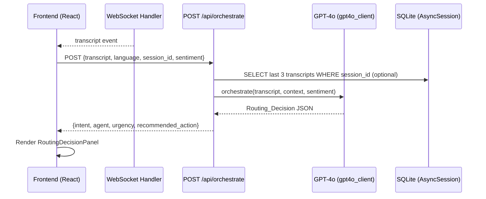

# Design Document: Branch Concierge Orchestrator

## Overview

The Branch Concierge Orchestrator is an AI routing layer that sits on top of the existing Linguist-Guardian FastAPI backend. It receives a customer transcript (plus optional sentiment and session context), calls GPT-4o with a purpose-built system prompt, and returns a structured `Routing_Decision` JSON object that tells the frontend dashboard which agent is handling the customer and what action to take.

The orchestrator follows the same architectural patterns already established in the codebase: a Pydantic request/response model, an async FastAPI router, a `.txt` system prompt loaded via `load_prompt()`, and optional DB access via `get_db()`.

---

## Architecture



The orchestrator is a thin async function in `core/orchestrator.py` that composes the prompt and calls GPT-4o. The route in `api/routes/orchestrate.py` handles HTTP concerns (validation, DB lookup, error fallback) and delegates to the core function.

---

## Components and Interfaces

### Backend

**`linguist-guardian/backend/core/orchestrator.py`**

New module. Exports a single async function:

```python
async def route_conversation(
    transcript: str,
    language: str,
    sentiment: dict | None,
    prior_context: list[dict],   # last ≤3 transcript rows from DB
) -> dict                        # Routing_Decision
```

Internally it:
1. Loads `orchestrator_routing.txt` via the existing `load_prompt()` utility.
2. Builds a user message containing transcript, language, sentiment signal, and prior context.
3. Calls `client.chat.completions.create(model="gpt-4o", response_format={"type": "json_object"})`.
4. Returns the parsed dict, or raises `OrchestratorParseError` on malformed output.

**`linguist-guardian/backend/api/routes/orchestrate.py`**

New FastAPI router. Registers `POST /` (mounted at `/api/orchestrate` in `main.py`).

Request model:
```python
class OrchestrateRequest(BaseModel):
    transcript: str
    language: str = "en"
    session_id: str | None = None
    sentiment: dict | None = None
```

Response model (always returned, even on fallback):
```python
class RoutingDecision(BaseModel):
    intent: str
    agent: str
    urgency: str
    recommended_action: str
```

Error handling:
- Empty `transcript` → HTTP 400.
- `OrchestratorParseError` or any LLM exception → fallback `RoutingDecision` (see Requirement 4.3).
- Missing prompt file at startup → `FileNotFoundError` with descriptive message.

**`linguist-guardian/backend/prompts/orchestrator_routing.txt`**

System prompt instructing GPT-4o to return only valid JSON with the four required fields, enumerating all four agents, their topics, and the three urgency levels.

**`linguist-guardian/backend/main.py`** (modified)

Add one import and one `include_router` call:
```python
from api.routes import orchestrate
app.include_router(orchestrate.router, prefix="/api/orchestrate", tags=["Orchestrator"])
```

### Frontend

**`linguist-guardian/frontend/src/services/orchestratorService.js`**

New service file following the pattern of `gpt4oService.js`:
```js
export async function routeConversation(transcript, language, sessionId, sentiment)
// POST /api/orchestrate → RoutingDecision
```

**`linguist-guardian/frontend/src/store/orchestratorStore.js`**

New Zustand store:
```js
{
  decision: null,   // latest RoutingDecision | null
  loading: false,
  error: null,
  setDecision(d), setLoading(b), setError(e), reset()
}
```

**`linguist-guardian/frontend/src/components/routing/RoutingDecisionPanel.jsx`**

New component rendered in the sidebar of the active session dashboard. Displays `agent`, `urgency`, and `recommended_action`. Applies urgency-based border color: red (`critical`/`high`), amber (`medium`), neutral (`low`).

**`linguist-guardian/frontend/src/hooks/useWebSocket.js`** (modified)

After receiving a `transcript` event, call `routeConversation()` and dispatch to `orchestratorStore`. On API failure, show a non-blocking toast notification (using the existing `react-hot-toast` dependency).

---

## Data Models

### OrchestrateRequest (Pydantic)

| Field | Type | Required | Default | Notes |
|---|---|---|---|---|
| `transcript` | `str` | Yes | — | Must be non-empty |
| `language` | `str` | No | `"en"` | ISO 639-1 code |
| `session_id` | `str \| None` | No | `None` | Used for context lookup |
| `sentiment` | `dict \| None` | No | `None` | `{emotion, stress_level}` from SentimentEngine |

### RoutingDecision (Pydantic + JSON contract)

| Field | Type | Allowed Values |
|---|---|---|
| `intent` | `str` | Free text label, or `"unclear"` / `"parse_error"` |
| `agent` | `str` | `CUSTOMER_SERVICE_AGENT`, `DOCUMENT_VERIFICATION_AGENT`, `QUEUE_MANAGEMENT_AGENT`, `COMPLIANCE_MONITOR_AGENT` |
| `urgency` | `str` | `"low"`, `"medium"`, `"high"` |
| `recommended_action` | `str` | Plain English staff instruction |

### Fallback RoutingDecision (on parse error)

```json
{
  "intent": "parse_error",
  "agent": "QUEUE_MANAGEMENT_AGENT",
  "urgency": "medium",
  "recommended_action": "Direct customer to nearest available counter"
}
```

### Noisy/Short Transcript Fallback

```json
{
  "intent": "unclear",
  "agent": "QUEUE_MANAGEMENT_AGENT",
  "urgency": "low",
  "recommended_action": "Ask customer to repeat their request"
}
```

### Prior Context Shape (passed to GPT-4o)

The last ≤3 `Transcript` rows for the session, serialized as:
```json
[
  {"speaker": "customer", "text": "...", "intent": "...", "language": "mr"},
  ...
]
```

---

## Correctness Properties

*A property is a characteristic or behavior that should hold true across all valid executions of a system — essentially, a formal statement about what the system should do. Properties serve as the bridge between human-readable specifications and machine-verifiable correctness guarantees.*

### Property 1: Routing_Decision always contains all four required fields

*For any* non-empty transcript (in any supported language, with or without sentiment), the orchestrator SHALL return a dict containing exactly the keys `intent`, `agent`, `urgency`, and `recommended_action`, all with non-empty string values.

**Validates: Requirements 1.1, 4.1, 4.2**

---

### Property 2: Agent field is always a valid enum value

*For any* transcript and any optional sentiment signal, the `agent` field in the returned Routing_Decision SHALL be exactly one of: `CUSTOMER_SERVICE_AGENT`, `DOCUMENT_VERIFICATION_AGENT`, `QUEUE_MANAGEMENT_AGENT`, `COMPLIANCE_MONITOR_AGENT`.

**Validates: Requirements 1.2**

---

### Property 3: Urgency field is always a valid enum value

*For any* transcript and any optional sentiment signal, the `urgency` field in the returned Routing_Decision SHALL be exactly one of: `low`, `medium`, `high`.

**Validates: Requirements 1.3**

---

### Property 4: Customer service keywords route to CUSTOMER_SERVICE_AGENT

*For any* transcript that contains at least one keyword from the set {balance, passbook, ATM, debit card, loan, FD, RD, internet banking}, the `agent` field SHALL be `CUSTOMER_SERVICE_AGENT`.

**Validates: Requirements 1.4**

---

### Property 5: Document keywords route to DOCUMENT_VERIFICATION_AGENT

*For any* transcript that contains at least one keyword from the set {Aadhaar, PAN, KYC, identity, passbook validation}, the `agent` field SHALL be `DOCUMENT_VERIFICATION_AGENT`.

**Validates: Requirements 1.5**

---

### Property 6: Queue keywords route to QUEUE_MANAGEMENT_AGENT

*For any* transcript that contains at least one keyword from the set {token, queue, counter, waiting time}, the `agent` field SHALL be `QUEUE_MANAGEMENT_AGENT`.

**Validates: Requirements 1.6**

---

### Property 7: Compliance keywords route to COMPLIANCE_MONITOR_AGENT

*For any* transcript that contains at least one keyword from the set {RBI, suspicious transaction, compliance}, the `agent` field SHALL be `COMPLIANCE_MONITOR_AGENT`.

**Validates: Requirements 1.7**

---

### Property 8: High-stress sentiment signals produce high urgency

*For any* transcript paired with a sentiment signal where `emotion == "distressed"` or `stress_level > 0.6`, the returned `urgency` SHALL be `"high"`.

**Validates: Requirements 2.1**

---

### Property 9: Medium-stress sentiment signals produce medium urgency

*For any* transcript paired with a sentiment signal where `emotion == "frustrated"` or `0.3 <= stress_level <= 0.6`, the returned `urgency` SHALL be `"medium"`.

**Validates: Requirements 2.2**

---

### Property 10: Absent sentiment does not cause failure

*For any* transcript where `sentiment` is `None` or omitted, the orchestrator SHALL return a valid Routing_Decision (all four fields present, agent and urgency are valid enum values) without raising an exception.

**Validates: Requirements 2.3, 2.5**

---

### Property 11: Distress keywords override sentiment to produce high urgency

*For any* transcript containing at least one of {fraud, stolen, emergency, urgent}, regardless of the sentiment signal value (including low stress or absent sentiment), the returned `urgency` SHALL be `"high"`.

**Validates: Requirements 2.4**

---

### Property 12: Multi-language transcripts always produce valid routing decisions

*For any* transcript in any of the supported languages (Marathi, Hindi, Tamil, Telugu, Bengali, Gujarati, Kannada, Malayalam, English), the orchestrator SHALL return a valid Routing_Decision with all four fields present and agent/urgency as valid enum values.

**Validates: Requirements 3.4, 3.5**

---

### Property 13: Orchestrator does not write to the database

*For any* call to `route_conversation()`, the number of rows in all database tables SHALL be identical before and after the call.

**Validates: Requirements 7.3**

---

### Property 14: Session context is fetched and bounded to 3 entries

*For any* session with N prior transcripts (N ≥ 1), when `session_id` is provided, the context passed to GPT-4o SHALL contain `min(N, 3)` transcript entries.

**Validates: Requirements 7.1**

---

### Property 15: RoutingDecisionPanel renders all three decision fields

*For any* valid Routing_Decision object, the rendered `RoutingDecisionPanel` component SHALL contain the `agent`, `urgency`, and `recommended_action` values in its output.

**Validates: Requirements 8.1**

---

### Property 16: Urgency indicator styling matches urgency value

*For any* Routing_Decision, the `RoutingDecisionPanel` SHALL apply the high-urgency style (red) when `urgency == "high"`, the medium-urgency style (amber) when `urgency == "medium"`, and the neutral style when `urgency == "low"`.

**Validates: Requirements 8.2, 8.3, 8.4**

---

### Property 17: WebSocket transcript events trigger orchestrate API call

*For any* WebSocket `transcript` event received by the frontend, the `routeConversation` service function SHALL be called with the transcript text, language, session_id, and current sentiment data.

**Validates: Requirements 8.5**

---

### Property 18: Orchestrator API failure shows toast and preserves conversation

*For any* orchestrator API call that fails (network error or non-2xx response), the frontend SHALL display a toast notification AND the existing conversation messages SHALL remain unchanged in the session store.

**Validates: Requirements 8.6**

---

## Error Handling

| Scenario | Behavior |
|---|---|
| Empty `transcript` in HTTP request | Return HTTP 400 with message `"transcript must not be empty"` |
| LLM returns malformed / non-JSON | Catch `json.JSONDecodeError`, return fallback `RoutingDecision` (intent=`parse_error`, agent=`QUEUE_MANAGEMENT_AGENT`, urgency=`medium`) |
| LLM API timeout or network error | Catch `openai.APIError`, return same fallback `RoutingDecision` |
| `orchestrator_routing.txt` missing at startup | `load_prompt()` raises `FileNotFoundError`; let it propagate so FastAPI startup fails with a clear message |
| `session_id` provided but no transcripts found | Proceed with empty prior context list; no error |
| `session_id` provided but DB unavailable | Log warning, proceed with empty prior context; do not fail the request |
| Frontend orchestrate call fails | Catch in `useWebSocket`, call `toast.error(...)`, do not modify `messages` in session store |

---

## Testing Strategy

### Unit Tests (pytest + pytest-asyncio)

Focus on specific examples, edge cases, and error conditions:

- `test_empty_transcript_returns_400` — HTTP 400 on empty string input.
- `test_noise_only_transcript_fallback` — `[inaudible]` input returns `intent=unclear`, `agent=QUEUE_MANAGEMENT_AGENT`, `urgency=low`.
- `test_malformed_llm_response_fallback` — mock GPT-4o to return `"not json"`, verify fallback RoutingDecision.
- `test_missing_prompt_file_raises` — rename prompt file, verify `FileNotFoundError` on import.
- `test_session_context_empty_no_error` — call with `session_id` that has no transcripts, verify success.
- `test_endpoint_registered` — verify `POST /api/orchestrate` returns 200 for a valid request (integration).
- `test_prompt_file_contains_agent_names` — verify `orchestrator_routing.txt` contains all four agent names.

### Property-Based Tests (Hypothesis)

Each property test runs a minimum of **100 iterations**. The property-based testing library is **Hypothesis** (Python).

Each test is tagged with a comment in the format:
`# Feature: branch-concierge-orchestrator, Property N: <property_text>`

| Property | Test Description |
|---|---|
| Property 1 | `@given(transcript=st.text(min_size=1))` — response always has all four fields |
| Property 2 | `@given(transcript=st.text(min_size=1))` — `agent` always in valid set |
| Property 3 | `@given(transcript=st.text(min_size=1))` — `urgency` always in `{low, medium, high}` |
| Property 4 | `@given(keyword=st.sampled_from([...]))` — customer service keywords → correct agent |
| Property 5 | `@given(keyword=st.sampled_from([...]))` — document keywords → correct agent |
| Property 6 | `@given(keyword=st.sampled_from([...]))` — queue keywords → correct agent |
| Property 7 | `@given(keyword=st.sampled_from([...]))` — compliance keywords → correct agent |
| Property 8 | `@given(stress=st.floats(min_value=0.61, max_value=1.0))` — high stress → `urgency=high` |
| Property 9 | `@given(stress=st.floats(min_value=0.3, max_value=0.6))` — medium stress → `urgency=medium` |
| Property 10 | `@given(transcript=st.text(min_size=1))` — `sentiment=None` never raises |
| Property 11 | `@given(keyword=st.sampled_from([fraud, stolen, emergency, urgent]), stress=st.floats(0,0.3))` — distress keywords override low sentiment to `urgency=high` |
| Property 12 | `@given(language=st.sampled_from([mr, hi, ta, te, bn, gu, kn, ml, en]))` — all languages return valid decision |
| Property 13 | `@given(transcript=st.text(min_size=1))` — DB row counts unchanged after call |
| Property 14 | `@given(n=st.integers(min_value=1, max_value=10))` — context capped at 3 entries |
| Property 15 | `@given(decision=routing_decision_strategy())` — panel renders all three fields |
| Property 16 | `@given(urgency=st.sampled_from([low, medium, high]))` — correct CSS class applied |
| Property 17 | Mock WS event — `routeConversation` called with correct args |
| Property 18 | Mock API failure — toast shown, messages unchanged |

Properties 15–18 use **Vitest** + **@testing-library/react** on the frontend side, with `@fast-check/vitest` as the property-based testing library.
