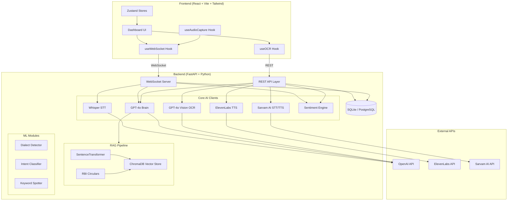

# 🛡️ Linguist-Guardian — System Architecture

## Overview

Linguist-Guardian is a **Multilingual Gen-AI Banking Concierge** with **Multimodal Document Sight** and **Sentiment Intelligence**. It assists Indian bank branch staff in serving customers who speak regional languages, by providing real-time transcription, translation, intent extraction, document verification, sentiment monitoring, and RBI compliance checking.

---

## Architecture Diagram



---

## Data Flow

### 1. Real-Time Conversation (WebSocket)

```
Customer Mic → Audio Chunk (3s) → base64 → WebSocket →
  ├─ Whisper STT → Transcript
  ├─ GPT-4o → Intent + Staff Advisory
  └─ Librosa → Sentiment Analysis
      ↓
Staff Dashboard ← JSON response ← WebSocket
```

### 2. Document Verification (REST)

```
Camera/Upload → Image → base64 → POST /api/ocr/analyze →
  └─ GPT-4o Vision → OCR + Cross-check → Staff Action
```

### 3. Text-to-Speech (REST)

```
Staff Response Text → POST /api/tts/synthesize →
  ├─ ElevenLabs (emotion-adaptive) → MP3
  └─ Sarvam AI (Indian languages) → MP3
```

---

## Component Breakdown

### Frontend (React + Vite)

| Component | File | Purpose |
|-----------|------|---------|
| Dashboard | `pages/index.jsx` | Main concierge interface |
| Reports | `pages/reports.jsx` | Analytics & session history |
| Session Detail | `pages/session/[id].jsx` | Session replay & summary |
| ConversationPanel | `components/conversation/` | Real-time transcript display |
| SentimentMonitor | `components/sidebar/SentimentMonitor.jsx` | Live stress chart |
| DocumentOCR | `components/sidebar/DocumentOCR.jsx` | Camera/upload OCR |

### Backend (FastAPI)

| Route | Endpoint | Purpose |
|-------|----------|---------|
| Transcription | `POST /api/transcribe/` | Whisper STT |
| Intent | `POST /api/intent/extract` | GPT-4o intent extraction |
| Compliance | `POST /api/intent/compliance` | RBI compliance check |
| TTS | `POST /api/tts/synthesize` | ElevenLabs/Sarvam TTS |
| OCR | `POST /api/ocr/analyze` | GPT-4o Vision document analysis |
| Sentiment | `POST /api/sentiment/analyze` | Librosa audio sentiment |
| Session | `/api/session/*` | CRUD + AI summary |
| WebSocket | `WS /ws/audio/{session_id}` | Real-time audio streaming |

### ML Modules

| Module | Purpose |
|--------|---------|
| `dialect_detector/` | Regional dialect identification (Puneri, Mumbai, Vidarbha Marathi, etc.) |
| `intent_classifier/` | Offline TF-IDF + SVM intent classifier (fallback for GPT-4o) |
| `keyword_spotter/` | Banking keyword scanning with urgency mapping |

---

## Tech Stack

| Layer | Technology |
|-------|------------|
| **STT** | OpenAI Whisper Large-v3 + Sarvam AI (Saarika v2) |
| **Brain** | GPT-4o (intent extraction, compliance, summaries) |
| **OCR** | GPT-4o Vision (document analysis + cross-check) |
| **TTS** | ElevenLabs Multilingual v2 + Sarvam AI (Bulbul v1) |
| **Sentiment** | Librosa (pitch, speech rate, volume analysis) |
| **RAG** | ChromaDB + SentenceTransformer (all-MiniLM-L6-v2) |
| **Frontend** | React 18 + Vite + Tailwind CSS + Zustand + Recharts |
| **Backend** | FastAPI + SQLAlchemy (async) + WebSockets |
| **Database** | SQLite (dev) / PostgreSQL (prod) |

---

## Languages Supported

Marathi (MR), Hindi (HI), Tamil (TA), Telugu (TE), Bengali (BN), Gujarati (GU), Kannada (KN), Malayalam (ML), English (EN)
